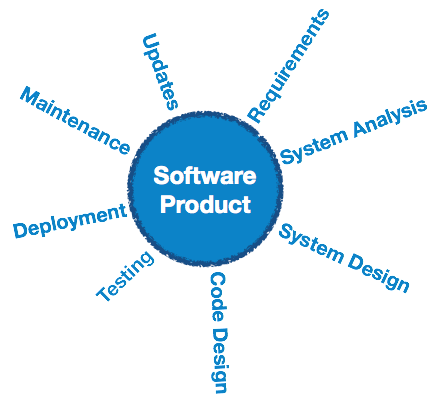

# Sopropl

**Software engineering** is an engineering branch associated with development of software product using well-defined scientific principles, methods and procedures. The outcome of software engineering is an efficient and reliable software product.

this what I aim to achieve with **Sopropl**
